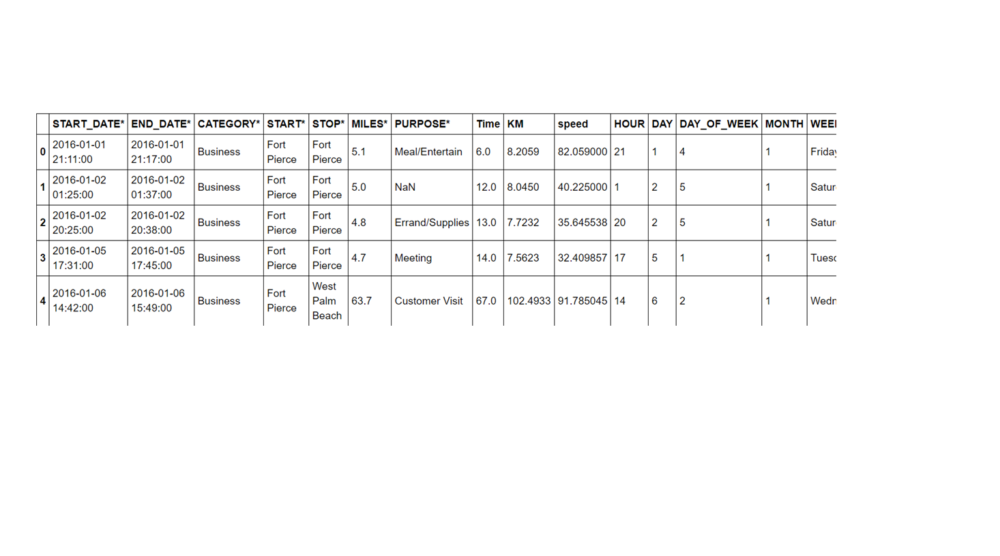
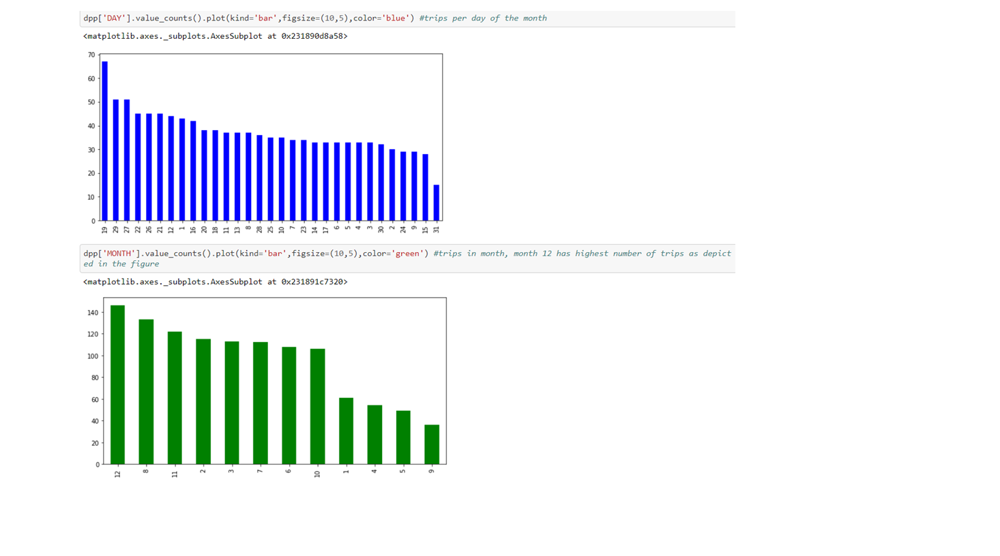

# Assam Science and Technology University
ASTU ECKOVATION Internship
Hello!
It's my codebase containing ASTU-IITG Internship final project.

My project deals with preprocessing of data and exploratory data analysis on dataset of the trips made by Uber.We find out the time taken and the average speed each Uber ride took.

The bar plots gives the results as trips made per hour of the day, per day of the week, and per month of the year.
 

Finally we find out the month in which  highest trips are made.
